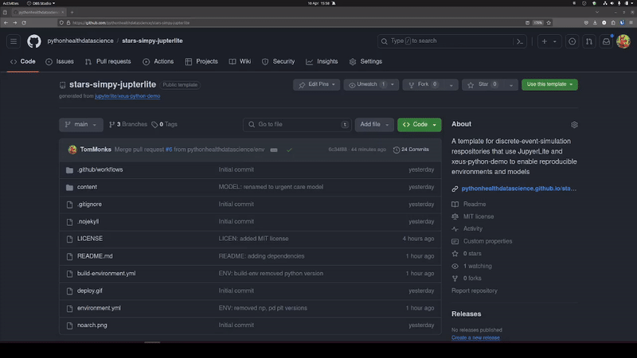
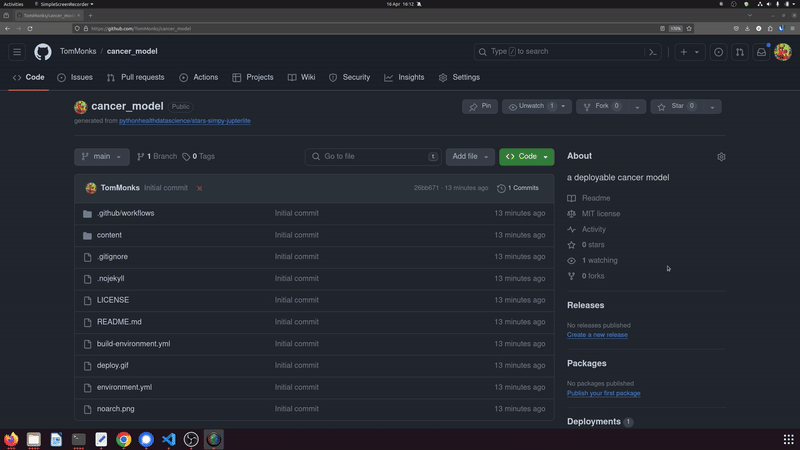

[](https://pythonhealthdatascience.github.io/stars-simpy-jupterlite/notebooks/?path=01_urgent_care_model.ipynb)
[](https://opensource.org/licenses/MIT)
[](https://doi.org/10.5281/zenodo.10987817)
[](https://www.python.org/downloads/release/python-3100/)
[](https://orcid.org/0000-0001-5274-5037)
[](https://orcid.org/0000-0003-2631-4481)

#  Towards Sharing Tools and Artifacts for **Reproducible** Simulation **(v1.5)**: a JuypterLite template for `simpy` models

## 1. Overview

The materials and methods in this repository support work towards developing the S.T.A.R.S healthcare framework version 1.5 (**S**haring **T**ools and **A**rtifacts for **R**eproducible **S**imulations in healthcare).  The code and written materials here are a work in progress to demonstrate the application of S.T.A.R.S' version to sharing a `simpy` discrete-event simuilation model and associated research artifacts. 

The model will run on a users browser without the need to install any components.  This is achieved using Web Assembly technology i.e. [JupterLite](https://github.com/jupyterlite/jupyterlite) and [xeus-python](https://github.com/jupyter-xeus/xeus-python).  A model notebook is downloaded to the users local machine and all dependencies are pre-installed via conda-forge. The model then lives in the browsers cache. The user can make changes to the model or create new files and these are persisted (until the browser cache is cleared).  

> Try it in your browser now: https://pythonhealthdatascience.github.io/stars-simpy-jupterlite

### 1.1. Use case

* A researcher wishes to share a runnable version of a simulation model with their publication (e.g. written in `simpy`).  The code allows others to replicate the simulation results, tables and charts in a paper and allows others to reuse the model.
* The researcher wants the model to be immediately usable. Users should not need to install python, `simpy` or any dependencies.
* The researcher either wants to reduce load on online open science compute infrastructure (e.g. mybinder.org) or does not want to rely on it. 
* Users may want to use a version of their own data due to governance, ethics or other reasons **cannot upload the data to a remote instance of the model.**
* Loading the model is as simple as clicking a URL.

### 1.2. Credits ✨

> We would like to thank the [JupterLite](https://github.com/jupyterlite/jupyterlite) and [xeus-python](https://github.com/jupyter-xeus/xeus-python) developers for making this work possible. This discrete-event simulation focussed repository was based on the learning materials and template provided by [Jupyterlite xeus-python demo](https://github.com/jupyterlite/xeus-python-demo) and [tutorial given at PyData 2023](https://www.youtube.com/watch?v=WXRslU9D3bo) by Jeremy Tuloup.

### 1.3. Citation

If you use the template in your work we would greatly appreciate a citation when you publish your work. 

> Monks, T., & Harper, A. (2024). Simpy JupyterLite Template (v0.1.0). Zenodo. https://doi.org/10.5281/zenodo.10987817

```
@software{monks_harper_jupyterlite_template,
  author       = {Monks, Thomas and
                  Harper, Alison},
  title        = {Simpy JupyterLite Template},
  month        = apr,
  year         = 2024,
  publisher    = {Zenodo},
  version      = {v0.1.0},
  doi          = {10.5281/zenodo.10987817},
  url          = {https://doi.org/10.5281/zenodo.10987817}
}
```


## 2. The example model included

The `simpy` model is adapted from [Monks and Harper (2023)](https://github.com/pythonhealthdatascience/stars-simpy-example-docs)

> Monks, T., & Harper, A. (2023). Towards Sharing Tools and Artifacts for Reusable Simulation: example enhanced documentation for a simpy model. (v1.1.0). Zenodo. https://doi.org/10.5281/zenodo.10054063

Full documentation of this model is available in our [JupyterBook](https://pythonhealthdatascience.github.io/stars-simpy-example-docs)

In summary, we adapt a textbook example from Nelson (2013): a terminating discrete-event simulation model of a U.S based treatment centren summary the model. The example is based on exercise 13 from Nelson (2013) page 170.

> *Nelson. B.L. (2013). [Foundations and methods of stochastic simulation](https://www.amazon.co.uk/Foundations-Methods-Stochastic-Simulation-International/dp/1461461596/ref=sr_1_1?dchild=1&keywords=foundations+and+methods+of+stochastic+simulation&qid=1617050801&sr=8-1). Springer.*

## 3. Try the example DES in your browser

* Jupyterlab: https://pythonhealthdatascience.github.io/stars-simpy-jupterlite
* Classic notebook: https://pythonhealthdatascience.github.io/stars-simpy-jupterlite/notebooks/?path=01_urgent_care_model.ipynb

## 4. Using the template to create a new repo.

> There are three steps: i.) create a new repo form the template; ii.) modify you repo settings so that GitHub pages are built from Actions.  iii.) Commit changes and trigger the GitHub Action and deployment. We recommend reading all instructions first.

Let's assume you wanted to create a new discrete-event simulation model of cancer services.  

1. The first step is to copy the template. Click on the green "use this template" button in the top right and select "create a new repository"
2. You will be prompted to enter a name of the repository - e.g. `cancer_model` - and a short description
3. Click on "Create Repository"



The JuypterLite interactive website is built from GitHub actions.  **In the newly created repo for your model** do the following

4. Navigate to "Settings->Pages"
5. Under "Build and Deployment" set the "Source" to "GitHub actions".



By default the build is trigged on any commit to the `main` branch.  Push a small commit and it will trigger the build.  This will take a few minutes.  Your site will be published under https://{USERNAME}.github.io/{DEMO_REPO_NAME}

## 5. How to install extra packages supporting your DES model. 📦

The repo contains two environment files. To install more dependencies for your DES model and analysis you need to edit the ``environment.yml`` file.

The template ``environment.yml`` is as follows:


```yml
name: xeus-python-kernel
channels:
  - https://repo.mamba.pm/emscripten-forge
  - conda-forge
dependencies:
  - xeus-python
  - ipycanvas
  - simpy=4.1.1
  - numpy
  - pandas
  - matplotlib
```

**Key points:**

* There are two channels in use. 
  * `encription-forge` contains specific versions of the packages for web assembly These include `numpy` `pandas`, and `matplotlib`. Other popular packages include `scipy`, `scikit-learn` and `pytest`.
  * `conda-forge` for other installs you can use conda-forge.  Only ``no-arch`` packages from ``conda-forge`` can be installed (simpy qualifies)
* Note that `numpy`, `pandas` and `matplotlib` have specific versions available on `enscription-forge`. For this reason we recommend not including the package version number.
* `simpy` is installed from `conda-forge` we were therefore able to freeze the version to 4.1.1 to aid reproducibility.
* At the time of writing the xeus-python kernal will use python 3.11.3

As an example modification assume that you wanted to add two new packages: `plotly` and `scipy`.  The first `plotly` is available ``no-arch`` from conda-forge so it is safe to include and if you wanted to you could try to include a version number. There is a specific version of `scipy` is available on `encription-forge`

Our modified environment looks like:

```yml
name: xeus-python-kernel
channels:
  - https://repo.mamba.pm/emscripten-forge
  - conda-forge
dependencies:
  - xeus-python
  - ipycanvas
  - simpy=4.1.1
  - numpy
  - pandas
  - matplotlib
  - plotly
  - scipy
```

If you wanted to use an alternative simulation package to `simpy` this would need to be available on `conda-forge` and be ``no-arch``.  An example package is `salabim`.  A modification of the enviroment is:


```yml
name: xeus-python-kernel
channels:
  - https://repo.mamba.pm/emscripten-forge
  - conda-forge
dependencies:
  - xeus-python
  - ipycanvas
  - salabim
  - numpy
  - pandas
  - matplotlib
  - plotly
  - scipy
```